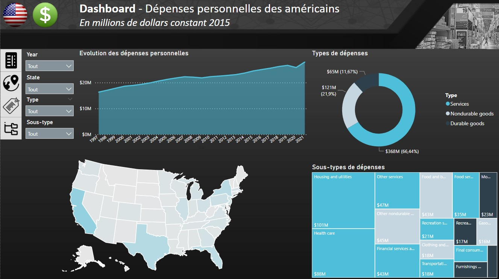
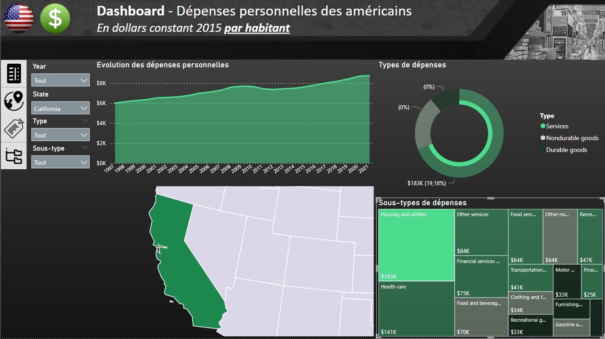

# Dashboard Power BI - Dépenses personnelles des Américains par Etat, de 1997 à 2021

### Objectif du projet : 
Réaliser un Dashboard Power BI à partir de la problématique : __Comment a évolué la composition des dépenses personnelles des Américains de 1997 à 2021 ?__
Données utilisées : BEA (Bureau of Economic Analysis).

### Dashboard Power BI : 
- Page 1 : Dépenses personnelles des américains (total)
- Page 2 : Dépenses personnelles des américains (par habitant)

